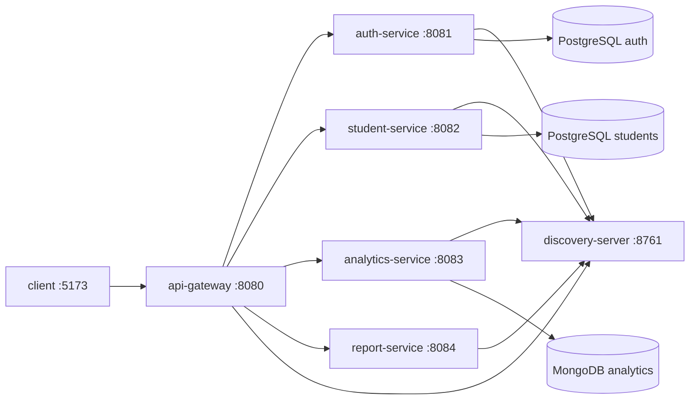

# Student Performance Predictor — Codebase Index

Human-oriented setup guide: [README.md](./README.md). **Full status & flows:** [PROJECT_STATUS.md](./PROJECT_STATUS.md). Cursor conventions: [.cursor/rules/codebase-index.mdc](./.cursor/rules/codebase-index.mdc).

Final-year project: a **student performance prediction and management** system. Spring Boot microservices behind an API gateway, with a React (Vite) SPA.

## Architecture



All HTTP from the browser goes to **`http://localhost:8080/api`** (see `client/src/lib/axios.ts`). The gateway routes by path prefix to Eureka-registered services.

| Service | Port | Spring name | Data store |
|---------|------|-------------|------------|
| discovery-server | 8761 | discovery-server | — (Eureka registry) |
| api-gateway | 8080 | api-gateway | — |
| auth-service | 8081 | auth-service | PostgreSQL `student_performance_auth` |
| student-service | 8082 | student-service | PostgreSQL `student_performance_students` |
| analytics-service | 8083 | analytics-service | MongoDB `student_performance_analytics` |
| report-service | 8084 | report-service | Feign clients only (no local DB) |

Stack: **Java 21**, **Spring Boot 3.2.5**, **Spring Cloud 2023.0.1** (Eureka, Gateway). Frontend: **React 19**, **Vite 8**, **TypeScript**, **MUI 9**, **Tailwind 4**, **Zustand**, **Axios**.

## Repository layout

```
final-year-project/
├── client/                    # React SPA (primary UI)
├── discovery-server/          # Netflix Eureka
├── api-gateway/               # Spring Cloud Gateway + CORS
├── auth-service/              # Login, register, JWT users
├── student-service/           # Students, attendance, marks, rankings, CSV
├── analytics-service/         # Risk prediction, performance records (MongoDB)
├── report-service/            # PDF/Excel watchlist exports
├── server_monolith_backup/    # Legacy single-app copy — ignore for active work
├── mvnw, mvnw.cmd             # Maven wrapper (run from repo root)
├── start-services.ps1         # Windows script to start all backends
└── kill_ports.ps1             # Windows port cleanup helper
```

Source roots:

- Backend: `{service}/src/main/java/com/varsha/{service}/`
- Backend config: `{service}/src/main/resources/application.yml`
- Frontend: `client/src/` — `pages/`, `features/`, `components/`, `layouts/`, `lib/`

## API surface (via gateway)

Gateway routes (`api-gateway/src/main/resources/application.yml`):

| Prefix | Service |
|--------|---------|
| `/api/auth/**` | auth-service |
| `/api/students/**`, `/api/csv/**` | student-service |
| `/api/analytics/**` | analytics-service |
| `/api/reports/**` | report-service |

### auth-service — `AuthController` (`/api/auth`)

- `POST /login` — returns JWT + user fields (`id`, `username`, `email`, `role`)
- `POST /register`
- `GET /users/count`

### student-service — `StudentController` (`/api/students`)

- CRUD: `GET`, `GET /page`, `GET /{id}`, `POST`, `PUT /{id}`, `DELETE /{id}`
- Interventions: `POST /{id}/interventions`, `GET /{id}/interventions`
- Attendance: `POST /attendance`, `GET /attendance`, `GET /attendance/stats`
- Rankings: `GET /rankings`
- Student self-service: `GET /my-performance`
- Dashboard: `GET /dashboard-summary`

### student-service — `CsvController` (`/api/csv`)

- `POST /upload/students`, `POST /upload/marks`
- `GET /files`, `GET /files/{id}/download`, `DELETE /files/{id}`

### analytics-service — `AnalyticsController` (`/api/analytics`)

- `POST /calculate` — run risk model for a student
- `GET /student/{studentId}`
- `GET /dashboard/summary`

Risk formula (MVP) in `PredictionEngineService`:

`(4.0 - GPA) * 15 + (100 - Attendance) * 0.5 + (10 - Behavior) * 2` → capped 0–100 → categories LOW / MEDIUM / HIGH.

### report-service — `ReportController` (`/api/reports`)

- `GET /watchlist/pdf`
- `GET /watchlist/excel`

JWT is validated per service; shared secret configured in each service’s `application.yml` under `app.jwt` (do not duplicate secrets in docs or commits).

## Frontend

| Area | Path | Notes |
|------|------|-------|
| Entry | `client/src/main.tsx`, `App.tsx` | React Router v7 |
| API client | `client/src/lib/axios.ts` | `baseURL: http://localhost:8080/api`, Bearer from `localStorage.token` |
| Auth state | `client/src/features/auth/authStore.ts` | Zustand + localStorage |
| Student state | `client/src/features/students/studentStore.ts` | |
| Analytics | `client/src/features/analytics/analyticsStore.ts` | |
| Reports | `client/src/features/reports/reportStore.ts` | |
| Notifications | `client/src/features/notifications/notificationStore.ts` | |

### Routes and roles (`App.tsx`, `Sidebar.tsx`)

| Route | Roles |
|-------|-------|
| `/dashboard` | all authenticated |
| `/students`, `/students/:id` | admin, teacher, counselor |
| `/attendance`, `/csv-management`, `/rankings` | admin, teacher, counselor |
| `/reports` | admin only |
| `/my-rank`, `/my-performance` | student |
| `/profile` | all authenticated |

Role strings are compared **lowercased** (`admin`, `teacher`, `counselor`, `student`).

## Domain model (student-service)

Key JPA entities under `com.varsha.studentservice.entity`:

- `Student` — profile, `userId` link to auth user (no cross-service JPA relation)
- `Attendance`, `Mark`, `Ranking`, `Intervention`, `CsvUpload`

Auth entity: `com.varsha.authservice.entity.User` with `Role` (many-to-one).

Analytics Mongo document: `PerformanceRecord` in analytics-service.

## Running locally

**Prerequisites:** PostgreSQL (auth + students DBs), MongoDB, JDK 21.

**Backends** (from repo root, per service or use `start-services.ps1` on Windows):

```bash
./mvnw -f discovery-server/pom.xml spring-boot:run
./mvnw -f api-gateway/pom.xml spring-boot:run
./mvnw -f auth-service/pom.xml spring-boot:run
./mvnw -f student-service/pom.xml spring-boot:run
./mvnw -f analytics-service/pom.xml spring-boot:run
./mvnw -f report-service/pom.xml spring-boot:run
```

Start **discovery-server first**, then gateway, then other services.

**Frontend:**

```bash
cd client && npm install && npm run dev
```

Dev server: `http://localhost:5173` (allowed in gateway CORS).

## Conventions for agents

1. **Active code** lives in `client/` and the six `*-service` / `discovery-server` / `api-gateway` folders. Do not modify `server_monolith_backup/` unless explicitly migrating from monolith.
2. **Package base:** `com.varsha.{servicename}` — keep new classes in the matching service module.
3. **API paths** must stay under `/api/...` so gateway routing continues to work.
4. **Cross-service calls** use Feign clients (e.g. `StudentServiceClient` in report-service and analytics-service), not shared databases.
5. **Frontend API calls** should use the shared `api` axios instance, not hard-coded service ports.
6. **Build artifacts** (`target/`, `client/dist/`, `node_modules/`) are ignored — edit sources only.

## Inter-service dependencies

- **report-service** → student-service, analytics-service (watchlist data for exports)
- **analytics-service** → student-service (student metadata for calculations)
- **student-service** → auth-service (`AuthServiceClient` for user linkage)

Eureka hostname: `http://localhost:8761/eureka/`.
