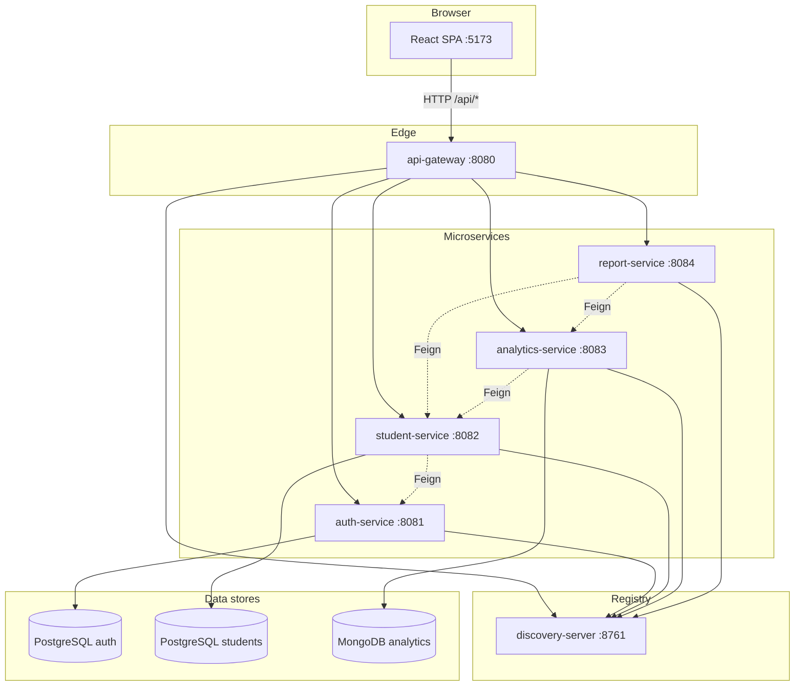
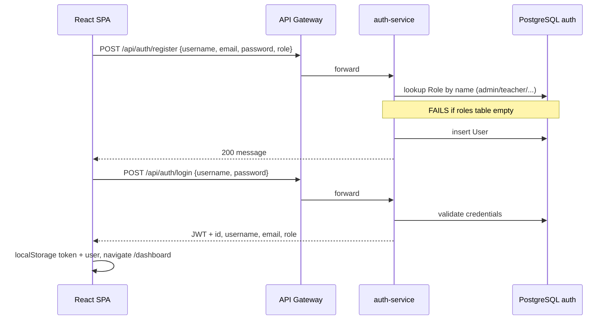
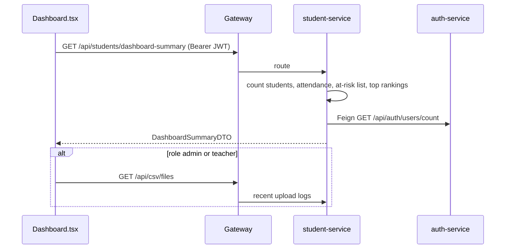
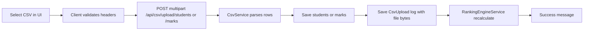

# Student Performance Predictor — Project Status & Knowledge Base

> **Purpose of this document:** Give any human developer or AI editor a complete picture of the project—what it does, how it is built, what works, what does not, and how data flows end to end.  
> **Last updated:** May 2026 (reflects microservices architecture + fixes applied during development sessions).  
> **Related docs:** [README.md](./README.md) (quick start), [AGENTS.md](./AGENTS.md) (code index for agents), [.cursor/rules/codebase-index.mdc](./.cursor/rules/codebase-index.mdc) (Cursor conventions).

---

## 1. Executive summary

**Student Performance Predictor** is a final-year academic project: a web system for schools to manage students, record attendance and marks, rank learners, predict at-risk students using a simple scoring model, and export watchlist reports.

| Layer | Technology |
|-------|------------|
| Frontend | React 19, TypeScript, Vite 8, MUI 9, Tailwind 4, Zustand, Axios, Recharts |
| API edge | Spring Cloud Gateway |
| Services | 4 Spring Boot microservices + Eureka discovery |
| Auth DB | PostgreSQL `student_performance_auth` |
| Student DB | PostgreSQL `student_performance_students` |
| Analytics DB | MongoDB `student_performance_analytics` |

**Maturity:** Functional for local development and demos. Not production-hardened (secrets in YAML, no role seed on fresh DB, ESLint debt, Windows-only start script paths).

---

## 2. System architecture



### Service responsibilities

| Service | Port | Responsibility |
|---------|------|----------------|
| `discovery-server` | 8761 | Eureka service registry |
| `api-gateway` | 8080 | Single public API, CORS, path-based routing |
| `auth-service` | 8081 | Users, roles, JWT login/register |
| `student-service` | 8082 | Students, marks, attendance, rankings, interventions, CSV import/export logs |
| `analytics-service` | 8083 | Risk score calculation, performance history (MongoDB) |
| `report-service` | 8084 | PDF/Excel watchlist (aggregates via Feign) |

### Gateway routing (`api-gateway/src/main/resources/application.yml`)

| Path prefix | Target service |
|-------------|----------------|
| `/api/auth/**` | auth-service |
| `/api/students/**`, `/api/csv/**` | student-service |
| `/api/analytics/**` | analytics-service |
| `/api/reports/**` | report-service |

**Browser rule:** All frontend calls use `http://localhost:8080/api` (`client/src/lib/axios.ts`). Never call service ports 8081–8084 directly from the UI.

---

## 3. Repository layout

```
final-year-project/
├── client/                         # React SPA (active UI)
├── discovery-server/
├── api-gateway/
├── auth-service/
├── student-service/
├── analytics-service/
├── report-service/
├── server_monolith_backup/         # LEGACY — do not use for active development
├── mvnw, mvnw.cmd
├── start-services.ps1              # Windows; paths may need editing
├── kill_ports.ps1
├── README.md
├── AGENTS.md
├── PROJECT_STATUS.md               # This file
└── .cursor/rules/codebase-index.mdc
```

**Ignore for indexing/editing:** `target/`, `node_modules/`, `client/dist/`, `server_monolith_backup/`.

---

## 4. User roles and access control

### Roles (database + JWT)

Stored in PostgreSQL `roles` table as enum names: `ROLE_ADMIN`, `ROLE_TEACHER`, `ROLE_COUNSELOR`, `ROLE_STUDENT`.

| App role (UI) | DB / Spring authority | Typical access |
|---------------|----------------------|----------------|
| `admin` | `ROLE_ADMIN` | Full staff features + PDF/Excel reports |
| `teacher` | `ROLE_TEACHER` | Students, attendance, CSV, rankings |
| `counselor` | `ROLE_COUNSELOR` | Same as teacher (no admin-only reports) |
| `student` | `ROLE_STUDENT` | Own rank, performance, profile |

### Frontend role handling

- JWT may return `ROLE_TEACHER` or `teacher` depending on auth-service version.
- **`client/src/lib/roles.ts`** — `normalizeRole()` strips `ROLE_` prefix and lowercases.
- **`authStore`** normalizes on login; **`migrate-roles.ts`** migrates old localStorage entries on app load.
- **`App.tsx`** / **`Sidebar.tsx`** use normalized roles for route guards.

### Route matrix (`client/src/App.tsx`)

| Route | Roles allowed |
|-------|----------------|
| `/login`, `/register` | Public |
| `/dashboard` | All authenticated |
| `/students`, `/students/:id` | admin, teacher, counselor |
| `/attendance`, `/csv-management`, `/rankings` | admin, teacher, counselor |
| `/reports` | admin only |
| `/my-rank`, `/my-performance` | student only |
| `/profile` | All authenticated |
| `/access-denied` | Fallback when role check fails |

---

## 5. End-to-end flows

### 5.1 Registration and login



**Important:**

- Fresh database has **no roles** until seeded manually (see §8.1).
- Invalid login returns **HTTP 500** with `"Bad credentials"` (should be 401)—handled in `auth-service` `GlobalExceptionHandler` as generic `Exception`.
- Login response role is normalized to `teacher` etc. in newer `AuthService` code; restart auth-service after pulls.

### 5.2 Staff dashboard load



**Student role** uses `GET /api/students/my-performance` instead (requires a `students` row with matching email).

**Past bug (fixed):** `ROLE_TEACHER` in JWT broke UI role checks → white dashboard. Fixed via `normalizeRole()` and chart changes.

### 5.3 Student CRUD

1. Staff opens `/students` → paginated list via `GET /api/students/page`.
2. Create/edit → `POST` / `PUT /api/students/{id}`.
3. Soft delete sets `status = "Deleted"` (not physical delete).
4. Student profile `/students/:id` → interventions, risk generation UI.

### 5.4 Attendance

1. Staff selects date on `/attendance`.
2. `GET /api/students/attendance?date=YYYY-MM-DD` — roster for that date.
3. Staff marks PRESENT/ABSENT per student.
4. `POST /api/students/attendance?date=YYYY-MM-DD` with body: `[{ "studentId": 1, "status": "PRESENT" }, ...]`.

**Note:** Date is a **query parameter**, not in JSON body.

### 5.5 CSV import (students and marks)



**Student CSV** — required header must include **email**; supports roll, first/last name, class, section, etc. (`CsvService.processStudentCsv`).

**Marks CSV** — requires roll number, subject, marks/score columns (`CsvService.processMarksCsv`).

**UI flow (`CSVManagement.tsx`):** Pick file → client validates → click Import → `uploadCsv` / `uploadMarksCsv` in `studentStore`.

**Fixed bug:** `CsvUpload.data` (`bytea`) failed with Hibernate `@Lob` → fixed with `@JdbcTypeCode(SqlTypes.VARBINARY)` in `CsvUpload.java`.

**Fixed bug:** Rankings `deleteAll` + `saveAll` caused duplicate key → fixed with upsert in `RankingEngineService`.

### 5.6 Risk analytics

1. Staff opens student profile → "Generate risk" (UI may use random GPA/attendance in `StudentProfile.tsx` for demo).
2. `POST /api/analytics/calculate` with JSON:
   ```json
   { "studentId": 1, "semester": "Fall2024", "gpa": 3.2, "attendancePercentage": 85, "behaviorScore": 8 }
   ```
3. `PredictionEngineService` computes score and stores `PerformanceRecord` in MongoDB.

**Formula (MVP):**

```
risk = (4.0 - GPA) * 15 + (100 - Attendance) * 0.5 + (10 - Behavior) * 2
capped 0–100 → LOW (<30) | MEDIUM (30–69) | HIGH (≥70)
```

4. `GET /api/analytics/student/{id}` — history + student info via Feign.
5. `GET /api/analytics/dashboard/summary` — counts and records for charts.

### 5.7 Reports (admin)

1. Dashboard or Reports page triggers download.
2. `GET /api/reports/watchlist/pdf` or `/watchlist/excel` (blob).
3. report-service fetches students + analytics summary via Feign, filters HIGH/MEDIUM risk.

---

## 6. Data model (summary)

### auth-service (PostgreSQL)

| Table | Purpose |
|-------|---------|
| `roles` | `ROLE_ADMIN`, `ROLE_TEACHER`, `ROLE_COUNSELOR`, `ROLE_STUDENT` |
| `users` | username, email, password (BCrypt), `role_id` |

### student-service (PostgreSQL)

| Entity | Purpose |
|--------|---------|
| `Student` | Profile; optional `userId` link to auth user |
| `Mark` | Per-subject scores |
| `Attendance` | Per-student per-date status |
| `Ranking` | Computed rank, total marks, percentage (unique per `student_id`) |
| `Intervention` | Counselor notes per student |
| `CsvUpload` | Audit log + binary copy of uploaded file |

### analytics-service (MongoDB)

| Document | Purpose |
|----------|---------|
| `PerformanceRecord` | studentId, semester, gpa, attendance, behavior, riskScore, riskCategory, createdAt |

---

## 7. API reference (via gateway `http://localhost:8080/api`)

### Auth — `/api/auth`

| Method | Path | Auth | Description |
|--------|------|------|-------------|
| POST | `/login` | Public | Returns JWT + user |
| POST | `/register` | Public | Body: `role` = admin\|teacher\|counselor\|student |
| GET | `/users/count` | Public* | Teacher/counselor/student counts |

\*Security config permits `/api/auth/**`; other services require JWT.

### Students — `/api/students`

| Method | Path | Roles (typical) |
|--------|------|-----------------|
| GET | `/` | Staff |
| GET | `/page` | Staff |
| GET | `/{id}` | Staff |
| POST | `/` | Staff |
| PUT | `/{id}` | Staff |
| DELETE | `/{id}` | Staff |
| POST | `/{id}/interventions` | Staff |
| GET | `/{id}/interventions` | Staff |
| POST | `/attendance?date=` | Staff |
| GET | `/attendance?date=` | Staff |
| GET | `/attendance/stats?date=` | Staff |
| GET | `/rankings` | Staff + student (masked for self) |
| GET | `/my-performance` | Student only |
| GET | `/dashboard-summary` | admin, teacher, counselor |

### CSV — `/api/csv`

| Method | Path | Description |
|--------|------|-------------|
| POST | `/upload/students` | multipart `file` |
| POST | `/upload/marks` | multipart `file` |
| GET | `/files` | List upload logs |
| GET | `/files/{id}/download` | Download stored CSV |
| DELETE | `/files/{id}` | Delete log |

### Analytics — `/api/analytics`

| Method | Path | Description |
|--------|------|-------------|
| POST | `/calculate` | Body: GenerateDataRequest |
| GET | `/student/{studentId}` | Student + history |
| GET | `/dashboard/summary` | Risk aggregates |

### Reports — `/api/reports`

| Method | Path | Description |
|--------|------|-------------|
| GET | `/watchlist/pdf` | PDF blob |
| GET | `/watchlist/excel` | Excel blob |

---

## 8. What is working ✅

Verified in local development (when PostgreSQL, MongoDB, and all services are up):

| Area | Status | Notes |
|------|--------|-------|
| Eureka registration | ✅ | 5 services register when started in order |
| API Gateway routing | ✅ | After restart; stale Eureka IPs can cause hangs |
| Register / login | ✅ | After roles table seeded |
| JWT on protected APIs | ✅ | Shared secret in each service `application.yml` |
| Student CRUD | ✅ | |
| Attendance save/load | ✅ | Query param `date` required |
| Rankings list | ✅ | Recalculated after marks CSV |
| Interventions | ✅ | |
| Staff dashboard summary | ✅ | Field `totalCsvUploads` mapped in UI |
| CSV student import | ✅ | After `CsvUpload` bytea fix |
| CSV marks import | ✅ | Requires existing students by roll number |
| CSV file list / download / delete | ✅ | |
| Analytics calculate + summary | ✅ | |
| PDF / Excel watchlist | ✅ | |
| Frontend build (`tsc` + `vite build`) | ✅ | With `react-is` override |
| Role normalization in UI | ✅ | Fixes ROLE_* mismatch |
| Dashboard charts | ✅ | Fixed-size BarChart (no ResponsiveContainer crash) |

---

## 9. What is not working or incomplete ⚠️

| Issue | Severity | Details / workaround |
|-------|----------|----------------------|
| **No automatic role seeding** | High on fresh DB | Register fails with "Role is not found." Run SQL in §10.1 once. |
| **Invalid login returns 500** | Medium | Should be 401; confusing for API clients. |
| **Student user without student row** | Medium | `GET /my-performance` → 404 if no `students` email match. |
| **Student–auth account linking** | Medium | `Student.userId` exists but registration does not auto-create student profile. |
| **Risk on profile uses mock data** | Low | `StudentProfile.tsx` randomizes GPA/attendance for `POST /analytics/calculate`. |
| **Eureka stale instances** | High ops | Old IP registrations cause gateway timeouts. Restart all services or clear Eureka. |
| **`start-services.ps1` paths** | Medium | Hardcoded `e:\final-year-project\`; fix for macOS/Linux. |
| **`npm run dev` on some Macs** | Medium | `vite` bin permission denied → use `node node_modules/vite/bin/vite.js`. |
| **ESLint** | Low | ~97 issues; build still passes. |
| **Secrets in repo** | Security | DB password and JWT secret in `application.yml`—use env vars for production. |
| **No automated tests in CI** | Low | Maven `test` exists but limited coverage. |
| **server_monolith_backup** | N/A | Outdated; ignore. |

---

## 10. Setup and run

### 10.1 Prerequisites

- JDK 21
- PostgreSQL (create DBs: `student_performance_auth`, `student_performance_students`)
- MongoDB (database `student_performance_analytics` created on first use)
- Node.js 18+ (for client)

### 10.2 One-time database seed (roles)

```sql
-- Connect to student_performance_auth
INSERT INTO roles (name) VALUES
  ('ROLE_ADMIN'),
  ('ROLE_TEACHER'),
  ('ROLE_COUNSELOR'),
  ('ROLE_STUDENT')
ON CONFLICT DO NOTHING;
```

(Adjust if your `roles.name` has a unique constraint; otherwise delete duplicates manually.)

### 10.3 Start backends (order matters)

From repo root (macOS/Linux):

```bash
bash mvnw -f discovery-server/pom.xml spring-boot:run
# wait ~15s
bash mvnw -f api-gateway/pom.xml spring-boot:run
bash mvnw -f auth-service/pom.xml spring-boot:run
bash mvnw -f student-service/pom.xml spring-boot:run
bash mvnw -f analytics-service/pom.xml spring-boot:run
bash mvnw -f report-service/pom.xml spring-boot:run
```

### 10.4 Start frontend

```bash
cd client
npm install
node node_modules/vite/bin/vite.js   # or npm run dev if bin permissions OK
```

### 10.5 URLs

| What | URL |
|------|-----|
| App | http://localhost:5173 |
| API | http://localhost:8080/api |
| Eureka | http://localhost:8761 |

### 10.6 Configuration

Each service: `{service}/src/main/resources/application.yml`

- PostgreSQL URL/user/password (auth + student)
- MongoDB URI (analytics)
- `app.jwt.secret` and `app.jwt.expiration-ms` (must match across services)
- Eureka: `http://localhost:8761/eureka/`

---

## 11. Troubleshooting

| Symptom | Likely cause | Fix |
|---------|--------------|-----|
| Register "Role is not found" | Empty `roles` table | Run §10.2 SQL |
| White / blank dashboard | `ROLE_*` in JWT or Recharts crash | Log out/in; ensure `normalizeRole` + chart fixes present |
| Gateway timeout | Stale Eureka instances | Restart all services; start discovery first |
| CSV import error `bytea` / `bigint` | Old `CsvUpload` entity | Pull fix: `@JdbcTypeCode(SqlTypes.VARBINARY)` |
| CSV import duplicate ranking key | Old ranking logic | Pull fix: upsert in `RankingEngineService` |
| `/students` → access denied | Role not normalized | Check `localStorage.user.role` is `teacher` not `ROLE_TEACHER` |
| Student dashboard 403 | Student JWT calling staff endpoint | Role branch in `Dashboard.tsx` |
| `npm run dev` permission denied | `node_modules/.bin` not executable | `chmod +x` or use `node .../vite.js` |

---

## 12. Fixes applied (changelog for maintainers)

| Date / session | Component | Change |
|----------------|-----------|--------|
| 2026-05 | `CsvUpload.java` | `@JdbcTypeCode(VARBINARY)` for PostgreSQL `bytea` |
| 2026-05 | `RankingEngineService.java` | Upsert rankings instead of delete-all + insert |
| 2026-05 | `client/lib/roles.ts` | Role normalization |
| 2026-05 | `authStore`, `migrate-roles.ts` | Persist normalized roles |
| 2026-05 | `AuthService.java` | Login returns `teacher` not `ROLE_TEACHER` |
| 2026-05 | `Dashboard.tsx` | `totalCsvUploads`, SafeChart / fixed BarChart, error messages |
| 2026-05 | `package.json` | `react-is` override for Recharts + React 19 |
| 2026-05 | Docs | README, AGENTS.md, PROJECT_STATUS.md, Cursor rules |

---

## 13. Frontend structure (quick map)

```
client/src/
├── main.tsx              # ThemeProvider, ErrorBoundary, role migration
├── App.tsx               # Routes + guards
├── lib/
│   ├── axios.ts          # API base URL + JWT interceptor
│   └── roles.ts          # normalizeRole()
├── features/
│   ├── auth/authStore.ts
│   ├── students/studentStore.ts
│   ├── analytics/analyticsStore.ts
│   ├── reports/reportStore.ts
│   └── notifications/notificationStore.ts
├── pages/
│   ├── auth/             # Login, Register, AccessDenied
│   ├── dashboard/        # Dashboard.tsx (role-specific)
│   └── students/         # Students, Attendance, CSV, Rankings, etc.
├── components/           # Sidebar, Navbar, ErrorBoundary, PerformanceBarChart
└── layouts/              # AuthLayout, DashboardLayout
```

---

## 14. Backend structure (quick map)

```
com.varsha.{service}/
├── *Application.java
├── controller/     # REST endpoints (/api/...)
├── service/        # Business logic
├── repository/     # JPA or Mongo
├── entity/         # JPA entities
├── document/       # Mongo documents (analytics)
├── dto/            # API payloads
├── security/       # JWT filter, util (per service)
├── config/         # SecurityConfig
└── client/         # Feign clients (cross-service)
```

---

## 15. Guidance for AI editors

1. Read this file + [AGENTS.md](./AGENTS.md) before large changes.
2. Do not edit `server_monolith_backup/` unless migrating from monolith.
3. Keep API paths under `/api/*` for gateway compatibility.
4. Use `normalizeRole()` for any new UI role checks.
5. Use `client/src/lib/axios.ts` for HTTP—not raw ports 8081–8084.
6. Cross-service data access only via Feign, not shared databases.
7. After entity changes to PostgreSQL, consider `ddl-auto: update` vs migrations.
8. Test CSV and dashboard flows after student-service changes.

---

## 16. Suggested next improvements (backlog)

- [ ] `RoleDataLoader` on auth-service startup (seed four roles)
- [ ] `BadCredentialsException` → 401 in auth `GlobalExceptionHandler`
- [ ] Link student registration to `students` table by email
- [ ] Use real marks/attendance for risk on `StudentProfile` (not `Math.random()`)
- [ ] Environment variables for secrets (`SPRING_DATASOURCE_PASSWORD`, `APP_JWT_SECRET`)
- [ ] Cross-platform `start-services.sh` for macOS/Linux
- [ ] Reduce ESLint errors; add CI workflow
- [ ] Integration tests for CSV upload and gateway routes

---

*End of project status document.*
