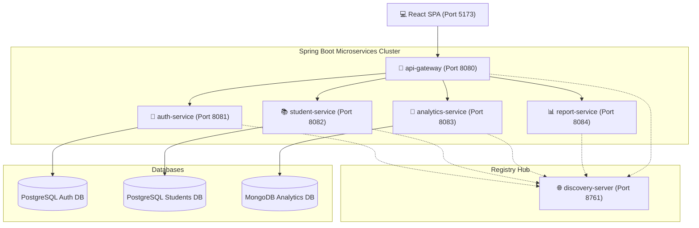

# 🎓 Student Performance Prediction & Management System

A production-ready, final-year project microservices platform that tracks student academic metrics, attendance profiles, rankings, and counselor slot bookings. It features a modern **React SPA frontend** connected to a robust, highly optimized **Spring Boot microservices architecture** operating behind a centralized API Gateway and utilizing Netflix Eureka Discovery.

---

## 🏗️ System Architecture

The client communicates solely with the API Gateway on port `8080`, which dynamically balances and routes requests to the registered service instances via Eureka Discovery:



---

## 🛠️ Technology Stack

| Layer | Component | Technologies |
|:---|:---|:---|
| **Frontend** | Single Page Application | **React 19**, **Vite 8**, **TypeScript**, **MUI 9**, **Tailwind CSS 4**, **Zustand** (State), **Axios** (API requests) |
| **Gateway** | Gateway Routing & CORS | **Spring Cloud Gateway 2023**, Netty, CORS policies |
| **Registry** | Service Discovery | **Netflix Eureka Server** |
| **Auth Service** | Access Control & Tokens | **Spring Security 6**, **JSON Web Tokens (JWT)**, JPA, PostgreSQL |
| **Student Service**| Students, Attendance, & Slots | JPA, Hibernate, PostgreSQL, File CSV Parser |
| **Analytics Service**| Risk Prediction Engine | **MongoDB**, Spring Data MongoDB |
| **Report Service** | Report Exports (Feign) | Apache POI (Excel), OpenPDF, Feign clients |

---

## ✨ System Modules & Features Explanations

The platform contains five major business features:

### 1. 📂 Branch & Student Lifecycle Management
* **Dynamic Branch Dashboard:** Added a unified **Branch Management** view for administrative controls to create and delete institutional branches (e.g. `CSE`, `ECE`, `MECH`, `CE`), track total headcount, view active faculty, and organize branch events.
* **Role-Based User Seeding:** Dynamic registration form alters field configurations automatically based on selection:
  * *Students* ➔ Standard academic attributes.
  * *Faculty & Counselors* ➔ Selected Branch, subjects taught, and dynamic class allocations.
  * *Principals* ➔ Read-only institutional dashboard visibility.
* **Automatic Default Passwords:** Instantly generates default credential keys for new users based on their registered email: `[First 3 characters of email] + #123`.

### 2. 🌳 Redesigned 2D Counselor Tree Map
* **Figma-Style Dot Canvas:** Overhauled from a simple list index to an extremely premium, dynamic 2D Mind-Map canvas layer equipped with mouse grab-to-pan dragging handlers and interactive zoom scale controls (`60%` to `140%`).
* **Bezier S-Curve Connectors:** Connects counselor desks, class batches, and students using smooth, organic SVG Bezier S-Curves calculated dynamically relative to the unscaled canvas wrapper.
* **Marching-Ants Animation:** Applies animated marching-ants (`stroke-dasharray`) pulses and neon glows to all connecting paths associated with hovered nodes in real time.
* **Boundary-Aware Inspector Tooltips:** Inspecting individual nodes triggers a floating Figma Property Inspector that dynamically flips positioning (above/below or left/right) relative to cursor coordinates to prevent clipping.

### 3. 🎯 Counselor Allocations Workspace (Drag-and-Drop)
* **Unassigned Roster Filters:** Filters unassigned students dynamically by branch and section; otherwise, displays a headcount summary prompt to guarantee highly-targeted rosters.
* **Emerald & Rose Validation Indicators:** Dragging a student highlights valid Counselor targets with bright emerald glows and locks/dims invalid target counselors (different branch) in a soft rose indicator.
* **HTML5 Drag-and-Drop:** Dropping students onto a valid Counselor card automatically calls the backend API for real-time allocation updates.
* **RIGID Branch Enforcement:** Strictly prevents assigning counselors to students of a different branch, enforced on both the client drag-handlers and the backend `StudentService.java` layer.

### 4. 📅 counseling Bookings & Scheduler
* **Real-Time Slots Scheduler:** Organizes slot bookings between students and counselors.
* **Past Booking Lockout:** Integrates a real-time server clock synchronization system. The calendar automatically blocks out slot selections in the past for the current day to preserve schedule booking integrity.

### 5. 👥 Scoped Role Visibility (ACL)
* **Admin:** Master credentials to delete/add any user accounts (excluding other Admins), reset passwords, and perform complete database "WIPE" procedures via multi-step confirmation prompts.
* **Principal:** Authorized under full read-only permissions across all analytical screens, reports, counselor trees, and student directories, but strictly blocked from modifying any data.
* **Faculty & HODs:** Can view academic metrics, students, and attendance sheets belonging only to their specific branch (all sections). All action elements and "Add/Edit" buttons are dynamically hidden.
* **Counselors:** Access restricted to their assigned students only.
* **Students:** Limited strictly to their personal ranks, performance trackers, and slot schedulers.

---

## 📂 Repository Organization

```
student-performance/
├── client/                    # React SPA (Primary UI portal)
├── discovery-server/          # Netflix Eureka Discovery Server
├── api-gateway/               # Spring Cloud Gateway Router
├── auth-service/              # JWT Security & Identity Store (Postgres)
├── student-service/           # Students profiles, attendance, & slots (Postgres)
├── analytics-service/         # Risk Predictor Engine (MongoDB)
├── report-service/            # PDF and Excel Watchlist Exporters
├── start-services.sh          # Optimized background services startup script
├── stop-services.sh           # Clean background services teardown script
├── .gitignore                 # Excludes compiled target and node files
├── README.md                  # System Knowledge Base & Explanations
├── setup.md                   # System Setup & Running Instructions
└── git.md                     # Git Collaboration & Flow Manual
```

---

## 📑 Core Documentation Map

Explore our detailed documentation files for step-by-step guidance:

* 📖 **[setup.md](./setup.md):** Comprehensive guide to configuring PostgreSQL databases, starting MongoDB, running services via scripts, and troubleshooting schema check constraints.
* 🌿 **[git.md](./git.md):** Complete guide to Git/GitHub, from installation and basic commands to branching strategies, Pull Request review protocols, and manual merge conflict resolutions.
