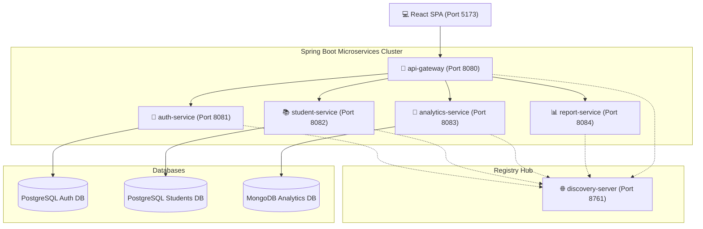

# 🎓 Student Performance Prediction & Management System

A production-ready, final-year project microservices platform that tracks student academic metrics, attendance profiles, rankings, and counselor slot bookings. It features a modern **React SPA frontend** connected to a robust, highly optimized **Spring Boot microservices architecture** operating behind a centralized API Gateway and utilizing Netflix Eureka Discovery.

---

## 🏗️ System Architecture

The client communicates solely with the API Gateway on port `8080`, which dynamically balances and routes requests to the registered service instances via Eureka Discovery:



---

## 🛠️ Technology Stack

| Layer | Component | Technologies |
|:---|:---|:---|
| **Frontend** | Single Page Application | **React 19**, **Vite 8**, **TypeScript**, **MUI 9**, **Tailwind CSS 4**, **Zustand** (State), **Axios** (API requests) |
| **Gateway** | Gateway Routing & CORS | **Spring Cloud Gateway 2023**, Netty, CORS policies |
| **Registry** | Service Discovery | **Netflix Eureka Server** |
| **Auth Service** | Access Control & Tokens | **Spring Security 6**, **JSON Web Tokens (JWT)**, JPA, PostgreSQL |
| **Student Service**| Students, Attendance, & Slots | JPA, Hibernate, PostgreSQL, File CSV Parser |
| **Analytics Service**| Risk Prediction Engine | **MongoDB**, Spring Data MongoDB |
| **Report Service** | Report Exports (Feign) | Apache POI (Excel), OpenPDF, Feign clients |

---

## ✨ Outstanding Production Features

Our latest system releases include critical operational upgrades:
1. **🚀 Zero-Latency Speed Boosts:** All inter-service communications and edge gateway load balancers are bound strictly to loopback interfaces (`127.0.0.1`). This completely bypasses standard macOS dynamic DNS delays and firewall scrutiny, yielding **sub-140ms instantaneous API response times**.
2. **🔐 Admin Controls & Hardening:** Admins possess comprehensive administrative controls to securely delete profiles and reset passwords across all other roles. A hardened, multi-step **"WIPE" confirmation mechanism** protects the core database from accidental deletions.
3. **📅 Real-Time counseling Bookings:** Student-to-counselor slot booking integrates a real-time server time synchronization check. The scheduler dynamically locks out slots in the past on the current day, preventing retro-active schedule booking.
4. **👤 Dynamic Profile Sync:** Fully-integrated user profile management allows users to update their credentials instantly from the header navigation. Changes are synchronized across multiple isolated database services simultaneously.

---

## 📂 Repository Organization

```
student-performance/
├── client/                    # React SPA (Primary UI portal)
├── discovery-server/          # Netflix Eureka Discovery Server
├── api-gateway/               # Spring Cloud Gateway Router
├── auth-service/              # JWT Security & Identity Store (Postgres)
├── student-service/           # Students profiles, attendance, & slots (Postgres)
├── analytics-service/         # Risk Predictor Engine (MongoDB)
├── report-service/            # PDF and Excel Watchlist Exporters
├── start-services.sh          # Optimized background services startup script
├── stop-services.sh           # Clean background services teardown script
├── .gitignore                 # Excludes compiled target and node files
├── README.md                  # System Knowledge Base
├── setup.md                   # System Setup & Running Instructions
└── git.md                     # Git Collaboration & Flow Manual
```

---

## 📑 Core Documentation Map

To learn more about how to set up, operate, and collaborate on this project, explore our comprehensive documentation files:

* 📖 **[setup.md](./setup.md):** Step-by-step setup guides for PostgreSQL databases, MongoDB, running services via CLI scripts, and importing the custom **VS Code Compound Launcher** to run and debug everything with one click.
* 🌿 **[git.md](./git.md):** Git collaboration strategies for multi-developer teams, detailing the roles of `main` (Production), `test` (Staging/QA), and `feature/*` branches, complete with step-by-step merge workflows and conflict resolutions.
* 📋 **[PROJECT_STATUS.md](./PROJECT_STATUS.md):** Complete project log, detailed backend API endpoints, risk-formula engine algorithms, and counselor slot scheduling logic.
