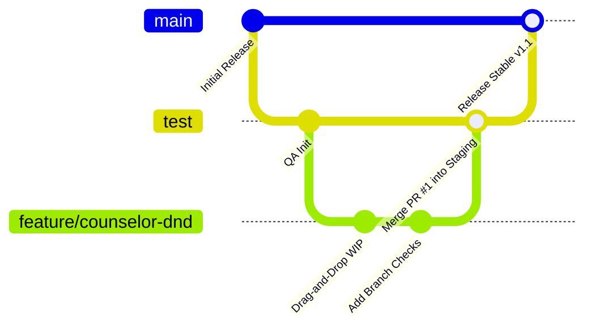

# 🌿 Git & GitHub Complete Collaboration Manual

Welcome to the **Git & GitHub Complete Collaboration Manual**! This guide is designed to take developers—from absolute beginners to senior contributors—through the process of installing Git, understanding core concepts, collaborating on GitHub, and mastering advanced multi-developer workflows with merge conflict resolutions.

---

## 🚀 1. Installation & First-Time Configuration

### A. Installing Git

#### 💻 On macOS:
Install Git via **Homebrew** (recommended):
```bash
brew install git
```
Alternatively, open your terminal and run `git --version`. If it is not installed, macOS will prompt you to install Xcode Command Line Tools, which includes Git.

#### 🪟 On Windows:
1. Download the **Git for Windows** installer from [git-scm.com](https://git-scm.com/).
2. Run the `.exe` installer. Keep the default selections, ensuring **Git Bash** is selected (this provides a Unix-like command-line environment on Windows).

#### 🐧 On Linux:
```bash
# Debian / Ubuntu
sudo apt update
sudo apt install git -y

# Fedora / Red Hat
sudo dnf install git -y
```

---

### B. First-Time Configuration
Set up your developer profile so your commits are attributed correctly on GitHub. Open a terminal (or Git Bash) and run:

```bash
# Configure your global username (use your exact GitHub name)
git config --global user.name "Your Name"

# Configure your global email (use the email linked to your GitHub account)
git config --global user.email "your.email@example.com"

# Set the default branch name to 'main'
git config --global init.defaultBranch main

# Optional: Enable credential caching so you don't type credentials repeatedly
git config --global credential.helper cache
```

Verify your configuration settings:
```bash
git config --list
```

---

## 🧠 2. Git Core Concepts & Everyday Commands

Git operates across four primary zones:
1. **Working Directory:** The local folder containing your files (untracked/modified).
2. **Staging Area:** A pre-commit sandbox where files are prepared for the next snapshot.
3. **Local Repository:** The local `.git` history database of committed snapshots.
4. **Remote Repository:** The hosted repository on GitHub shared by the team.

```
Working Directory ──[git add]──> Staging Area ──[git commit]──> Local Repository ──[git push]──> GitHub Remote
```

### Essential Commands List:

```bash
# 1. Clone an existing repository from GitHub
git clone https://github.com/username/repository.git

# 2. Check the status of modified, deleted, or untracked files
git status

# 3. Add a file (or all modified files) to the Staging Area
git add file.txt
git add .

# 4. Commit staged changes with a descriptive, professional message
git commit -m "feat: add branch filter selector to user management"

# 5. Fetch history and merge changes from GitHub into your local branch
git pull origin main

# 6. Push your local branch commits up to GitHub
git push origin feature/new-login-ui

# 7. View the commit history log
git log --oneline -n 10
```

---

## 🌿 3. Multi-Developer Branching Strategy

To maintain a clean, stable repository and prevent developers from overwriting each other's code, we utilize a **Feature Branch Workflow**.



### The Branch Hierarchy:

1. **`main` (Production):**
   * **Rule:** Strict read-only for developers. Nobody pushes directly to `main`.
   * **Content:** Production-ready code only.
   * **Updates:** Merged only via Pull Requests originating from the `test` branch.

2. **`test` (Staging / QA Integration):**
   * **Rule:** Developers do not push directly here. It is used to consolidate features.
   * **Content:** Pre-release code undergoing QA testing.
   * **Updates:** Features are merged here via GitHub Pull Requests.

3. **`feature/*` (Developer Workspaces):**
   * **Rule:** Isolated branch created for *one specific task* (e.g., `feature/branch-mgmt`).
   * **Content:** Developer's active work.
   * **Updates:** Pushed directly by the developer and merged into `test` when complete.

4. **`hotfix/*` (Emergency Patches):**
   * **Rule:** Branch cut directly from `main` to patch a critical bug in production.
   * **Updates:** Merged directly into `main` and back-merged into `test`.

---

## 🔄 4. Step-by-Step Developer Workflow

### Step 1: Sync Your Local Repository
Always pull the latest changes from the remote server before starting work to avoid conflicts later.
```bash
git checkout test
git pull origin test
```

### Step 2: Create a Feature Branch
Use descriptive, lowercase branch names prefixing with the type of work (`feat/`, `fix/`, `docs/`, `refactor/`).
```bash
git checkout -b feature/user-profile-editing
```

### Step 3: Write Code & Commit
Make small, focused commits. Avoid committing hundreds of lines across unrelated modules at once.
```bash
# Check your changes
git status

# Stage your changes
git add client/src/pages/students/Profile.tsx

# Commit with a message in Conventional Commits format
git commit -m "feat(profile): enforce old password matching on credential reset"
```

### Step 4: Push the Feature Branch to GitHub
```bash
git push origin feature/user-profile-editing
```

### Step 5: Open a Pull Request (PR)
1. Go to your repository on GitHub in your browser.
2. Click **Compare & pull request** next to your pushed branch.
3. Set the base branch to **`test`** (Staging) and your feature branch as the source.
4. Fill out the PR template, outlining the changes and verification tests performed.
5. Request review from a teammate.

### Step 6: Code Review & Merging
1. Reviewers leave inline comments or approve the changes.
2. Once approved, the reviewer or assignee merges the PR on GitHub using **Squash and Merge** (collapses all intermediate WIP commits into one single clean commit on staging).
3. Delete the remote branch on GitHub using the web dashboard.
4. Delete your local branch to keep your environment clean:
   ```bash
   git checkout test
   git pull origin test
   git branch -d feature/user-profile-editing
   ```

---

## 💥 5. Mastering Merge Conflict Resolution

A merge conflict occurs when two developers modify the **same lines of the same file** in different ways, and Git cannot automatically decide which version to keep.

### Step-by-Step Conflict Resolution:

1. **Trigger the Merge:**
   Suppose you are on your feature branch and want to merge staging (`test`) to resolve upstream updates:
   ```bash
   git checkout feature/counselor-dnd
   git merge test
   ```
   If a conflict occurs, Git outputs:
   `CONFLICT (content): Merge conflict in client/src/pages/students/Students.tsx`
   `Automatic merge failed; fix conflicts and then commit the result.`

2. **Locate the Conflicts:**
   Open the conflicting file in your code editor (e.g. VS Code). Search for the Git conflict markers:
   
   ```
   <<<<<<< HEAD
   // Your local changes on your feature branch
   const validCardColor = "bg-emerald-50 border-emerald-300 text-emerald-900";
   =======
   // The upstream changes pulled from the test branch
   const validCardColor = "bg-green-50 border-green-200 text-green-800";
   >>>>>>> test
   ```

3. **Resolve the Dispute:**
   Decide whether to keep your changes, keep the upstream changes, or combine both. 
   **Crucial:** Delete all conflict markers (`<<<<<<<`, `=======`, `>>>>>>>`) from the file before saving.

4. **Stage and Finalize:**
   Once the file is cleaned, stage it and create a standard merge commit:
   ```bash
   # Mark the conflict as resolved by staging
   git add client/src/pages/students/Students.tsx

   # Check that all conflicts are clear
   git status

   # Commit the resolution (Git will auto-populate a merge message)
   git commit -m "merge: resolve conflicts with test branch in Students.tsx"

   # Push the resolved code safely to GitHub
   git push origin feature/counselor-dnd
   ```

---

## 🎯 6. Git Best Practices

* **Conventional Commits:** Write clear messages using prefix markers:
  * `feat:` for new capabilities.
  * `fix:` for bug resolutions.
  * `docs:` for markdown updates.
  * `style:` for formatting/visual tweaks.
* **Keep `.gitignore` updated:** Never commit your target directories, node modules, environment configs, or personal log files.
* **Never commit hardcoded secrets:** Keep passwords, private API keys, and JWT secrets strictly inside local configuration profiles (like `application.yml` or `.env` files) that are bypassed by `.gitignore`.
* **Push early and often:** Push your branch up to GitHub daily, even if incomplete. This ensures your work is backed up and your team is aware of your progress.
