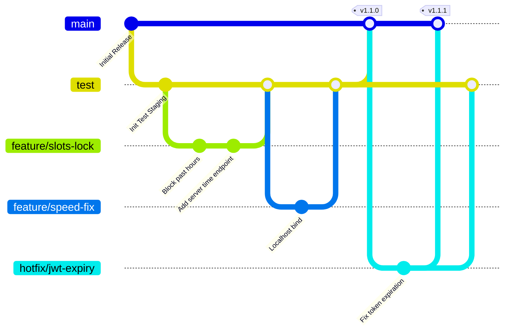

# 🌿 Git Operations & Branching Strategy

This guide defines the Git branching strategy and daily development workflows for the **Student Performance Predictor** project. Following these standards ensures code safety, seamless teamwork among multiple developers, and high production-level stability.

---

## 📐 Git Branching Architecture

We adopt a tailored **Git Flow** strategy designed to separate unstable development code from tested staging releases and hot-swappable production deployments.



### 1. Permanent Branches
* **`main` (Production Branch):**
  * Represents high-quality, production-ready code.
  * Direct commits are strictly **forbidden**.
  * Only receives code via Pull Requests from the `test` branch (after validation) or from a `hotfix/*` branch.
  * Every merge into `main` should be tagged with a semantic version number (e.g., `v1.0.0`, `v1.1.0`).
* **`test` (Integration & Testing Branch):**
  * Acts as our staging/QA layer.
  * All developers merge their feature branches here to perform collaborative integration tests.
  * This code runs in staging environments to verify stability across microservices.

### 2. Supporting Branches (Temporary)
* **`feature/<name>` (Feature Branches):**
  * Branched from: `test` (or `main` if starting fresh).
  * Merged back into: `test`.
  * Naming convention: `feature/login-speedup`, `feature/slots-lock`, `feature/delete-profile`.
* **`hotfix/<name>` (Critical Patches):**
  * Branched from: `main` (Production).
  * Merged back into: **both** `main` and `test`.
  * Used for addressing live bugs in the production system.

---

## 🔄 Daily Collaboration Flow (Step-by-Step)

### Step 1: Sync Your Local Repository
Before starting any new work, always pull the latest changes from the remote repository to avoid merge conflicts:
```bash
git checkout test
git pull origin test
```

### Step 2: Create a Feature Branch
Create a branch for your specific task. Keep your feature scope narrow:
```bash
git checkout -b feature/your-feature-name
```

### Step 3: Implement & Commit Your Changes
Make incremental, logically separated commits with descriptive messages:
```bash
# Verify modified and untracked files
git status

# Stage your files
git add .

# Commit with a meaningful message
git commit -m "feat(student-service): restrict counseling bookings to future slots only"
```

### Step 4: Keep Your Feature Branch Updated
While you were coding, other developers may have merged changes into `test`. Sync your branch to handle conflicts early:
```bash
git checkout test
git pull origin test
git checkout feature/your-feature-name
git merge test
# Resolve conflicts in your editor if any occur, then commit the merge
```

### Step 5: Push & Open a Pull Request (PR)
Push your feature branch to the remote repository:
```bash
git push origin feature/your-feature-name
```
Navigate to your GitHub repository and open a Pull Request from **`feature/your-feature-name` ➔ `test`**.

### Step 6: Testing & Quality Assurance
1. Deploy the `test` branch to a local or remote testing server.
2. Conduct manual and automated verification tests.
3. Once the team signs off, merge `feature/your-feature-name` into `test`.

### Step 7: Release to Production (`main`)
At the end of a sprint or development cycle, once the `test` branch has been thoroughly checked:
1. Open a PR from **`test` ➔ `main`**.
2. Perform a final sanity check, then merge the PR.
3. Tag the production commit:
   ```bash
   git checkout main
   git pull origin main
   git tag -a v1.0.0 -m "Release version 1.0.0 including dashboard speed optimizations"
   git push origin v1.0.0
   ```

---

## ⚠️ Collaborative Best Practices

> [!IMPORTANT]
> **1. Never Commit Sensitive Data:**
> Do not commit API credentials, PostgreSQL/MongoDB passwords, or `.env` files. Ensure they are added to `.gitignore`.
>
> **2. Write Good Commit Messages:**
> Follow the Conventional Commits format to make tracking easy:
> * `feat(ui): ...` — New frontend feature.
> * `fix(auth): ...` — Bug fix in auth service.
> * `docs(readme): ...` — Updates to documentation.
> * `refactor(analytics): ...` — Restructuring without behavior change.
>
> **3. Verify Locally Before Pushing:**
> Always verify that your changes compile cleanly on your local machine before pushing. Do not push code that breaks compilation!
